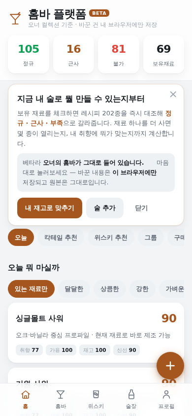
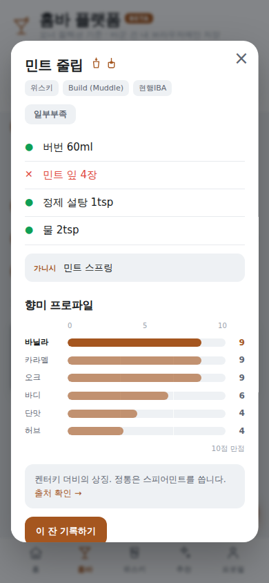
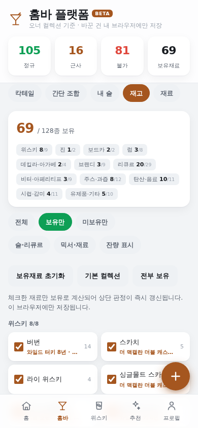

# 홈바 플랫폼

[](https://github.com/squarekim/homebar/actions/workflows/deploy-pages.yml)


**집에 있는 술로 지금 뭘 만들 수 있는지** 계산해 주는 모바일 우선 웹앱.
재료를 체크하면 칵테일 202종을 즉시 대조해 **정규 · 근사 · 부족**으로 갈라주고,
한 병 더 사면 몇 종이 열리는지, 내 취향엔 뭐가 맞는지, 위스키 컬렉션에 뭐가 비었는지까지 계산한다.

서버·계정·설치 없이 브라우저에서 돌아가며, 입력한 값은 전부 **사용자 브라우저에만** 저장된다.

| | 주소 |
|---|---|
| 홈바 플랫폼 (베타) | https://squarekim.github.io/homebar/ |
| 레거시 단일 파일 앱 | https://squarekim.github.io/homebar/legacy/ |

> [!NOTE]
> 아직 정식 공개 전이다. 지금 올라간 `beta` 빌드에는 **오너의 홈바(보유 주류 82종·재고 69건)** 가 들어 있다.
> 링크를 받은 사람은 아무거나 눌러봐도 된다 — 바꾼 값은 각자 브라우저에만 저장되고 원본은 그대로다.
> 개인 데이터를 뺀 정식 공개판은 [배포 프로필](#배포-프로필)만 바꿔 배포한다.

<p align="center">
  
  
  
</p>

## 목차

- [주요 기능](#주요-기능)
- [시작하기](#시작하기)
- [사용법](#사용법)
- [동작 방식](#동작-방식)
- [담긴 데이터](#담긴-데이터)
- [개발](#개발)
- [배포](#배포)
- [프로젝트 구조](#프로젝트-구조)
- [로드맵](#로드맵)
- [기여](#기여)
- [라이선스](#라이선스)
- [만든 배경과 출처](#만든-배경과-출처)

## 주요 기능

- **재고 → 즉시 판정** — 재료 128종을 체크하면 레시피 202종의 제조 가능 여부가 실시간으로 다시 계산된다
- **술 추가(제품 검색 자동 입력)** — 이름만 검색해 고르면 대분류·세부분류·도수·용량·원산지·위스키 분류·칵테일 표준 재료가 자동으로 채워진다. 기준 DB 275종
- **간단 조합** — 셰이커 없이 잔에 바로 붓는 조합 70종. 비율·잔·**내 술로 만드는 법**까지
- **변형 레시피 연결** — 레시피 42종이 원형과 이어져 있다. 올드 패션드를 열면 몬테 카를로·팬시 프리 같은 변형이 뜨고, 변형 쪽에서는 "설탕 대신 베네딕틴" 처럼 무엇을 바꾼 것인지 한 줄로 본다
- **구매 시뮬레이션** — 재료 하나를 사면 추가로 열리는 레시피 수로 순위화
- **취향 추천** — 14축 향미 벡터 기반. 외부 AI 없이 점수와 이유를 함께 제시
- **그룹 추천** — 여러 명 취향 결합. 평균이 아니라 한 명이라도 강하게 싫어하는 향미에 패널티
- **위스키 결손 분석** — 지역 × 숙성 매트릭스와 축 커버리지로 컬렉션의 빈칸을 계산, 구매 시뮬레이터 제공
- **음용 기록 · JSON 백업 · PWA 설치/오프라인**

## 시작하기

### 그냥 써보기

https://squarekim.github.io/homebar/ 를 열면 끝이다. 설치도 가입도 없다.
모바일 브라우저의 **홈 화면에 추가**를 누르면 앱처럼 쓸 수 있다(PWA).

> [!IMPORTANT]
> 카카오톡·인스타그램 등 **앱 내장 브라우저**나 **시크릿 모드**에서는 브라우저 저장소가 막혀 있어 동작하지 않는다.
> 그 경우 안내 화면이 뜨니 사파리·크롬으로 다시 열면 된다.

### 로컬에서 실행

```bash
git clone https://github.com/squarekim/homebar.git
cd homebar/app
npm install
npm run dev      # http://localhost:5173
```

Node 20 이상만 있으면 된다. 서버도 DB도 API 키도 필요 없다.

## 사용법

### 5분 시작

1. **재고 맞추기** — `술장 → 재고`에서 `보유재료 초기화`를 누르고 집에 있는 것만 체크한다. 체크할 때마다 상단 숫자가 바로 바뀐다
2. **술 등록** — 우하단 **+** 버튼. `발베니 12`, `조니블랙`, `Absolut`처럼 대충 쳐도 찾아준다
3. **마시고 기록** — 추천 카드나 레시피에서 `기록하기`. 몇 잔 쌓이면 취향 프로필이 자동으로 잡힌다

상단 숫자 4개(정규·근사·불가·보유재료)는 **눌러보면 뜻이 뜬다.**

### 상황별로 어디를 여나

| 상황 | 어디서 | 뭘 얻나 |
|---|---|---|
| 오늘 뭐 마시지 | 홈 → **오늘** | 기분별 추천 + 지금 바로 되는 것만 필터 |
| 이거 만들 수 있나 | 홈바 → **칵테일** | 레시피별 판정과 **뭐가 없어서 안 되는지** |
| 간단하게 한 잔 | 홈바 → **간단 조합** | 하이볼·토닉류 70종, 비율·잔·내 술 |
| 뭐 사지 | 홈 → **구매** | 재료 하나 살 때 추가로 열리는 레시피 수 |
| 친구가 옴 | 홈 → **그룹** | 여러 명 취향 결합 추천 |
| 술 새로 삼 | 아무 화면 **우하단 +** | 이름 검색 → 분류·도수·재료 자동 등록 |
| 내 술 확인 | 술장 → **내 술** | 보유 병 전체, 분류·뱃지·공식 노트·연결된 표준 재료 |
| 위스키 뭐 살까 | 위스키 → **축별 결손** | 비어 있는 칸 + 구매 시뮬레이터 |

### 탭 구성

| 탭 | 내용 |
|---|---|
| **홈** | 오늘 · 칵테일 추천 · 위스키 추천 · 그룹 · 구매 · 재고 소진 |
| **홈바** | 칵테일 · 간단 조합 · 재료 |
| **위스키** | 컬렉션(분류·공식 노트) · 축별 결손 매트릭스 · 구매 시뮬레이터 |
| **술장** | 내 술(보유 병) · 재고(표준 재료) |
| **프로필** | 취향 14축 · 그룹 인원 · 통계 · 음용 기록 · JSON 백업/복원 · 버전 |

## 동작 방식

### 판정 4단계

| 상태 | 뜻 |
|---|---|
| **정규** | 필수 재료를 전부 보유, 대체 없이 원 레시피대로 |
| **근사** | 필수 재료는 다 있지만 일부를 대체재로 충당 |
| **일부부족** | 부재료가 빠짐(기주는 있음) |
| **불가** | 기주 등 핵심 재료가 없음 |

`(선택)` 표기 재료는 판정에서 제외한다. 판정은 **구조화된 재고 데이터로만** 계산하며, 레시피 설명문은 판정에 관여하지 않는다.

### 제품이 아니라 표준 재료로 매칭한다

```
봄베이 사파이어 ┐
탱커레이       ├→ 표준 재료 '런던 드라이 진' → 진토닉 · 네그로니 · 마티니 …
비피터         ┘
```

어떤 브랜드를 넣든 같은 표준 재료로 해석되므로 레시피가 똑같이 열린다.
술을 추가할 때 이 연결이 자동으로 맺어진다.

### 취향 14축

단맛 · 스모크 · 피트 · 과일 · 바닐라 · 카라멜 · 오크 · 스파이스 · 플로럴 · 허브 · 시트러스 · 견과 · 초콜릿 · 바디 (각 0~10).
추천 엔진은 **외부 AI 없이** 이 벡터만으로 동작한다.

### 내 데이터는 어디에 있나

- 재고·기록·취향·메모·추가한 술은 전부 **브라우저(IndexedDB)** 에만 저장된다. 서버로 가지 않는다
- 기기를 옮기려면 `프로필 → JSON 백업`으로 파일을 받고 새 기기에서 복원한다
- 브라우저 데이터를 지우면 함께 지워진다. 중요한 기록은 주기적으로 백업할 것
- 같은 링크를 여러 명이 열어도 서로 영향이 없다

## 담긴 데이터

| | 수량 | 비고 |
|---|---|---|
| 칵테일 레시피 | **202종** | 현행 IBA 99종 포함. 재료 참조 732건 전부 재료 마스터로 매핑 |
| 재료 마스터 | **128종** | 재고·레시피가 공유하는 표준 재료 |
| 간단 조합 | **70종** | 믹서 비율표 + Build 계열 레시피 |
| 주류 기준 DB | **377종** | 위스키 145 · 리큐르 54 · **맥주 37(수제맥주 16 포함)** · 사케·소주·전통주 27 · 진 16 · 럼 16 · 보드카 13 · 데킬라 13 · 브랜디 13 · RTD·캔칵테일 10 · 부재료 10 · 베르무트 9 · 와인 9 · 기타 5 |
| 제조사 공식 노트 | **43종** | 제품 id 기준. 공식 사이트 등 출처 URL과 함께 표기하고, 확인 못 한 제품은 비워 둔다 |
| 오너 컬렉션(beta) | **82종** | 위스키 23종 포함. 정식 공개판에서는 빠진다 |

## 개발

```bash
cd app
npm run dev           # 개발 서버 (beta 프로필)
npm run build         # 타입체크 + 빌드(dist/) — 오너 데이터 포함
npm run build:public  # 공개 배포 빌드(dist-public/) — 개인 데이터 제외
npm test              # 단위 테스트(vitest) 42건
```

React 18 + TypeScript + Vite + Dexie(IndexedDB) + PWA. 런타임 의존성 4개.
추후 Capacitor로 Android APK 래핑이 가능하도록 브라우저 전용 코드는 저장소 계층 뒤로 격리했다.

기여 규칙·아키텍처 지도·건드리면 안 되는 것은 **[CONTRIBUTING.md](CONTRIBUTING.md)** 에 있다.

## 배포

`.github/workflows/deploy-pages.yml` 이 GitHub Pages로 배포한다. **수동 실행 전용**이다.

> Actions → `Deploy to GitHub Pages` → **Run workflow** → 프로필 선택

레거시 단일 파일 앱은 같은 배포에서 `/legacy/` 로 함께 올라가 기존 링크가 유지된다.

### 배포 프로필

| | `beta` (기본) | `public` |
|---|---|---|
| 레시피 202 · 재료 128 · 간단 조합 · 주류 마스터 275 | 포함 | 포함 |
| 오너 보유 주류 82종 · 개인 재고 69건 | **포함** | **번들에서 제외** |
| 첫 화면 | 오너 컬렉션 (정규 105) | 기본 홈바 세트 41종 (정규 79) |

`public` 빌드는 `app/scripts/makePublicSeed.mjs` 가 개인 데이터를 제거한 시드를 만들어 vite 플러그인이 원본 대신 물린다. **원본 `seed.ts` 는 수정하지 않는다.**

배포된 화면이 어느 버전인지는 `프로필 → 버전`에서 빌드 시각과 커밋으로 확인한다.

## 프로젝트 구조

```
.
├── app/                    # 웹앱 (React + TypeScript + Vite)
│   ├── src/
│   │   ├── data/           # 시드(읽기 전용) + 파생: 향미·분류·용어·주류 마스터
│   │   ├── models/         # 도메인 타입
│   │   ├── db/             # Dexie 스키마·마이그레이션
│   │   ├── repositories/   # DB 접근 격리 계층
│   │   ├── services/       # 판정·추천·그룹·구매·검색·백업 (순수 로직)
│   │   └── ui/             # 화면 (하단 5탭 + 전역 추가 버튼)
│   └── scripts/            # 시드 변환 스크립트 (손으로 고치지 않는다)
├── docs/screenshots/       # README 이미지
├── index.html              # 레거시 단일 파일 앱
└── .github/workflows/      # Pages 배포
```

데이터는 한 방향으로만 흐른다: `data → models → db → repositories → services → ui`.
화면이 DB를 직접 호출하지 않으므로 나중에 계정·동기화를 붙일 때 저장소 계층만 교체하면 된다.

## 로드맵

- [ ] 주류 기준 DB 확장 (현재 377종)
- [ ] 추가한 술 편집
- [x] 제조사 공식 노트를 기준 DB 제품에 매핑 — 술 추가 화면에서 바로 보인다
- [ ] 재고 잔량 입력 UI 개선
- [ ] 계정 · 기기 간 동기화
- [ ] Capacitor로 Android APK

## 기여

이슈와 PR을 환영한다. 시작하기 전에 [CONTRIBUTING.md](CONTRIBUTING.md) 를 읽어 주세요 — 10분 세팅, 계층 규칙,
`seed.ts` 를 손으로 고치지 않는 이유, PR 체크리스트가 정리돼 있다.

버그 제보와 기능 제안은 [이슈 템플릿](https://github.com/squarekim/homebar/issues/new/choose)을 이용해 주세요.

## 라이선스

**아직 정하지 않았다.** 라이선스가 명시되기 전까지는 저작권이 저작자에게 유보되며, 포크·재배포·상업적 이용은 허용되지 않는다.
사용하고 싶다면 이슈로 문의해 주세요.

## 만든 배경과 출처

개인 홈바를 정리하려고 쓰던 엑셀(`홈바_마스터_가이드_V54.xlsx`)에서 출발했다.
그 데이터를 단일 HTML 앱(`index.html`)으로 옮겼고, 지금은 같은 데이터를 재사용하는 웹앱으로 확장하는 중이다.

- 레시피 스펙은 [IBA(International Bartenders Association)](https://iba-world.com/) 공식 등재 항목을 우선했고, 비IBA 항목은 클래식·커뮤니티 표준을 출처와 함께 표기했다
- 제조사 테이스팅 노트는 공식 브랜드/증류소 페이지에서 수집하고 **출처 URL을 함께 저장**했다. 확인되지 않은 항목은 비워 두었다
- 위스키 분류(원산지·타입·지역·캐스크·캐릭터)는 라벨·증류소 공개 정보 기준이며, 향미 벡터는 규칙 기반 파생값이라 공식 데이터가 아니다

### 원본에서 고친 것 (V54)

1. **블랙 러시안** — 재료가 `커피 리큐르 [없음]`이었으나 깔루아를 보유 중이다. 깔루아는 커피 리큐르이므로 미보유 표기가 잘못됐다. 정규 104 → 105
2. **플랜터즈 펀치** — `사탕수수 주스/시럽`의 슬래시가 재료 구분자로 파싱돼 한 재료가 둘로 쪼개졌다. `사탕수수 주스 또는 시럽` 단일 재료로 통합했다
